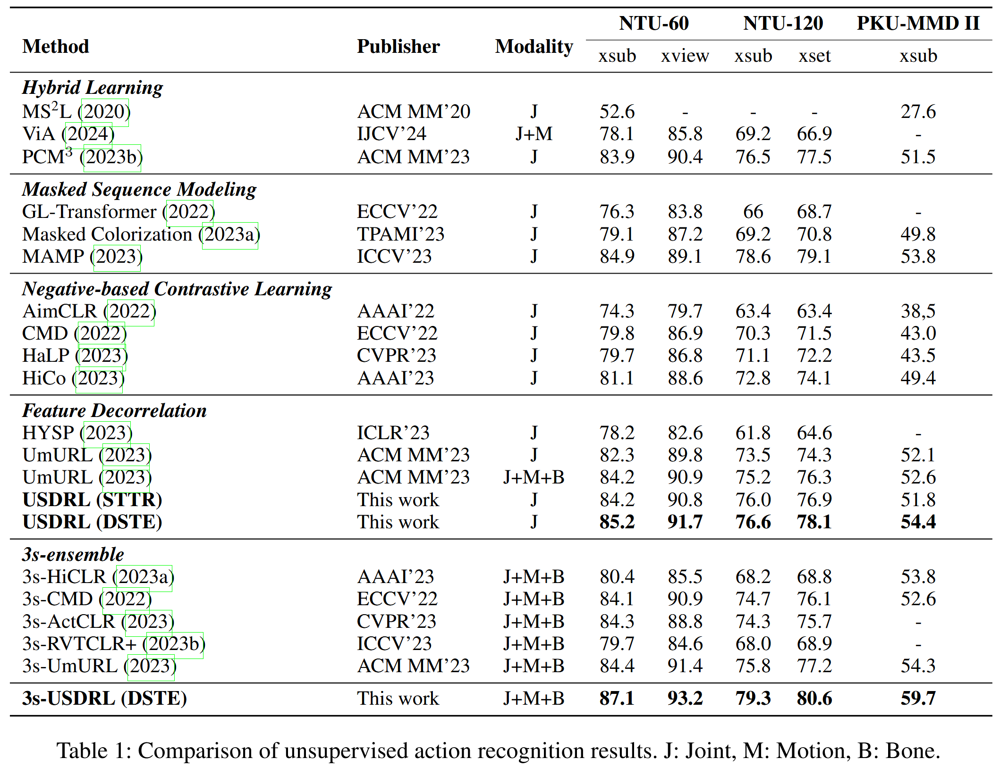

# USDRL: Unified Skeleton-Based Dense Representation Learning with Multi-Grained Feature Decorrelation
**This is a repository containing the implementation of our AAAI 2025 paper USDRL.** [[Paper Link]](https://arxiv.org/abs/) [[Github]]([wengwanjiang/USDRL](https://github.com/wengwanjiang/USDRL))


## Abstract

Contrastive learning has achieved great success in skeleton-based representation learning recently. However, the prevailing methods are predominantly negative-based, necessitating additional momentum encoder and memory bank to get negative samples, which increases the difficulty of model training. Furthermore, these methods primarily concentrate on learning a global representation for recognition and retrieval tasks, while overlooking the rich and detailed local representations that are crucial for dense prediction tasks. To alleviate these issues, we introduce a Unified Skeleton-based Dense Representation Learning framework based on feature decorrelation, called USDRL, which employs feature decorrelation across temporal, spatial, and instance domains in a multi-grained manner to reduce redundancy among dimensions of the representations to maximize information extraction from features. Additionally, we design a Dense Spatio-Temporal Encoder (DSTE) to capture fine-grained action representations effectively, thereby enhancing the performance of dense prediction tasks. Comprehensive experiments, conducted on the benchmarks NTU-60, NTU-120, PKU-MMD I, and PKU-MMD II, across diverse downstream tasks including action recognition, action retrieval, and action detection, conclusively demonstrate that our approach significantly outperforms the current state-of-the-art (SOTA) approaches. Our code and models are available at [Github Repo](https://github.com/wengwanjiang/USDRL).

## Requirements

```bash
python==3.8.13
torch==1.8.0+cu118
```

## Data Preparation

Please refer to [UmURL](https://github.com/HuiGuanLab/UmURL)

## Training and Testing

Unsupervised Pretraining Script (scripts/pretrain.sh):

```
# bash scripts/pretrain.sh 0,1 ntu60_xs_j_dste
gpu=0,1 #$1
dir=ntu60_xs_j_dste #$2
mkdir ./checkpoint/${dir}
CUDA_VISIBLE_DEVICES="$gpu" python pretrain.py --lr 0.0005   --batch-size 356  --schedule 351 --epochs 451 \
 --moda joint --checkpoint-path ./checkpoint/${dir} --backbone DSTE \
 --pre-dataset ntu60 --protocol cross_subject | tee -a ./checkpoint/${dir}/${dir}_pretrain.log
```

Linear Action Recognition Scritp (scripts/recog.sh):

```
# bash scripts/recog.sh 0 ntu60_xs_j_dste 45
gpu=0,1 #$1
dir=ntu60_xs_j_dste #$2
node=45 #$3
CUDA_VISIBLE_DEVICES="${gpu}" python action_recognition.py \
  --lr 0.006 --batch-size 512 --backbone DSTE --moda joint \
  --pretrained  ./checkpoint/${dir}/checkpoint_${node}.pth.tar \
  --finetune-dataset ntu60 --protocol cross_subject | tee -a ./checkpoint/${dir}/${dir}_recog.log
```

Action Retrieval (KNN-1) Scritp (scripts/knn.sh):
```
# bash scripts/knn.sh 0 ntu60_xs_j_dste 45
gpu=0 #$1
dir=ntu60_xs_j_dste #$2
node=45 #$3
CUDA_VISIBLE_DEVICES="${gpu}" python action_retrieval.py \
  --lr 0.006 --batch-size 512 --backbone DSTE --moda joint \
  --pretrained  ./checkpoint/${dir}/checkpoint_${node}.pth.tar \
  --finetune-dataset ntu60 --protocol cross_subject | tee -a ./checkpoint/${dir}/${dir}_recog.log
```

Test on Action Detection
Please Refer to the detection [repo](https://github.com/JHang2020/Simple-Skeleton-Detection/tree/main) due to the difference of codebase.

More streams can refer to **script/\*.sh**.

## Pretrained Models

coming soon
### Main Results



## Citation

If you find this work useful for your research, please consider citing our work:

```
@inproceedings{wengUSDRL25,
  title={USDRL: Unified Skeleton-Based Dense Representation Learning with Multi-Grained Feature Decorrelation},
  author={Wanjiang Weng and Hongsong Wang and Junbo Wang and Lei He and Guosen Xie},
  booktitle={Proceedings of the AAAI Conference on Artificial Intelligence},
  year={2025}
}
```


## Acknowledgment
The framework of our code is based on [UmURL](https://github.com/HuiGuanLab/UmURL).
